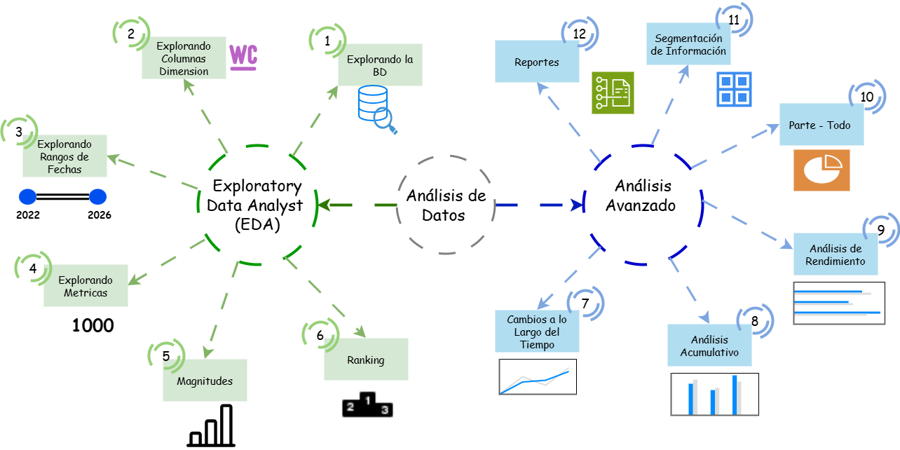

# Analisis-de-Datos-SQL-SERVER
Proyecto de análisis de datos EDA y avanzado
---
## Ruta del Proyecto 
Se emplea una gran cantidad de scripts en SQL Server para exploración, análisis e informe de los datos. 

1. EDA: Se implementan coceptos básicos de estadística, agregaciones, sub consultas y CTE.
2. Análisis Avanzado: Se implementas medidas estadísticas más avanzadas, CTE, segmentación, funciones de ventana, etc.
--- 
## Sobre Mi 
Buenos días, buenas tardes o buenas noches, dependiendo de cuando leas esto, mi nombre es Danfer Marcelo Ore, soy estudiante de ING. Sistemas, la finalidad del proyecto es poder explorar, analizar y realizar un informe con los datos analizados en este caso se generan 2 reportes 1 para clientes y otro para productos. 
Con este proyecto busco mostrar mis capacidades con el manejo de SQL server, consultas avanzadas y la planificación de proyectos. Los datos utilizados para este proyecto provienen de una etapa anterior  `1_DWH-Arquitectura-Medallón-SQL-SERVER`
