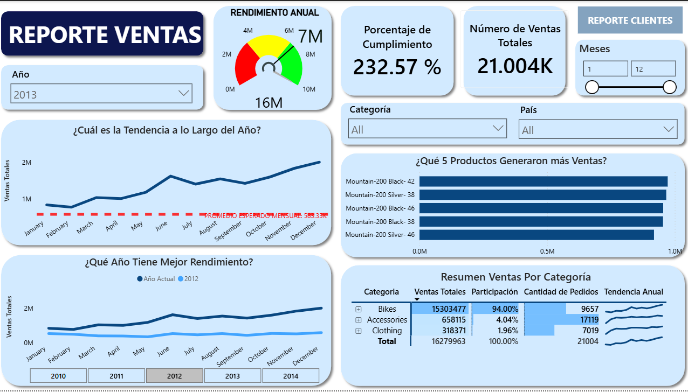
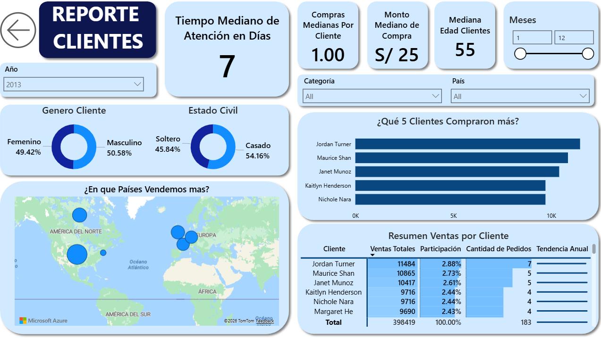

# Reporte-Ventas-Clientes-Power-BI

## Introducción
Este dashboard fue creado para que **la gerencia de ventas**, pueda obtener una reporte facíl de entender.  
Este reporte muestra indicadores claros de ventas, analisis a lo largo del tiempo, detalles de ventas e información de clientes. 

## Resumen del Dashboard
### Página 1: Reporte de Ventas

Es una vista general de las ventas de la empresa. Se busca mostrar una tendencia a lo largo del año, visualizar que productos son los que más se venden, compración de ingresos entre diferentes años. Tambien se muestran KPIs como `Porcentaje de Cumplimiento` y `Número total de Ventas`, se implementa un gráfico de termometro para visualizar de mejor manera las ventas totales con el objetivo anual.

### Página 2: Reporte de Clientes

Es una vista centrada en información sobre los clientes; se muestran KPIs como `Tiempo Mediano de Atención`, `Compras Medianas por Cliente`, `Monto Mediano de Compra` y `Mediana Edad Clientes`. Se utilizan gráficos de dona y matrices para visualizar información detallada de los clientes. 

## Habilidades Mostradas
  - **Esquema de Estrella**: Se implementa un esquema de estrella compuesto por una tabla de hechos principal `fact_ventas` y múltiples tablas de dimensiones, incluyendo `dim_clientes`, `dim_fecha` y `dim_producto`.
- **Métricas Específicas**: Se desarrollan métricas orientadas a negocio que permiten obtener KPIs clave como `Mediana Pedidos` y `Porcentaje de Cumplimiento`.
- **Gráficos Relevantes**: Se emplean **gráficos de barra horizontales**, **línea** y **dona** para analizar comparaciones y tendencias temporales.
- **Análisis Geoespacial**: Se incorporan **gráficos de mapa** para representar la distribución geográfica de ventas por país.
- **KPIs y Tablas**: Se utilizan **tarjetas** para destacar indicadores clave como `Mediana Pedidos`, `Porcentaje de Cumplimiento`, `Compras Medianas por Cliente` y `Mediana Edad Clientes`. Las tablas complementan el análisis mostrando el detalle de la información visualizada en los gráficos principalmente de clientes y productos.
- **Diseño del Dashboard**: Se diseña una interfaz clara, intuitiva y visualmente amigable, priorizando la simplicidad y enfocando cada sección en los elementos más relevantes para el análisis.
- **Reporte Interactivo**:
  - **Filtros**: Implementación de filtros dinámicos por año, categoría y país.
  - **Botones y Bookmarks**: Uso de controles interactivos para optimizar la navegación del usuario, `REPORTE CLIENTES` y botón para retroceder.
- **Power Query**: Uso de `Power Query` para la transformación y limpieza de datos y columnas reemplazar nulos por `n/a`.
- **Vista de Modelo**: Modelado de datos mediante la relación entre tablas `dim` y la tabla `fact`, incluyendo la configuración de filtros unidireccionales.
- **DAX**: Desarrollo de cálculos avanzados utilizando `DAX`, incluyendo la creación de columnas como `Nombre Completo` y tablas completas como `dim_fecha`.
- **Parámetros**: Uso de `Nuevo Parametro` para alternar entre métricas como `VENTAS_2010`, `VENTAS_2011`, `VENTAS_2012`, `VENTAS_2013` Y `VENTAS_2014`, permitiendo la visualización dinámica en un mismo gráfico.
- **Edición de Interacciones**: Se optimizan las interacciones entre las diferentes tablas con el objetivo de mejorar la dinámica y usabilidad del reporte.
## Conclusiones
Este Dashboard muestra cómo Power BI puede transformar información cruda en un reporte completo, lleno de información, este reporte ayuda en la toma de decisiones de gerentes o jefes de área. Se utilizan filtros para poder filtrar y segmentar la información con el objetivo de un mejor entendimiento.

## Sobre Mi 
Buenos días, buenas tardes o buenas noches, dependiendo de cuando leas esto, soy un Estudiante de Ing. Sistemas mi nombre es Danfer Marcelo Ore, me quiero especializar en análisis de datos, esta tercera parte del proyecto busca mostrar mi manejo en POWER Bi y mi capacidad de implementar diversas herramientas, los datos de este proyecto provienen de una etapa anterior`1_DWH-Arquitectura-Medallón-SQL-SERVER`.
