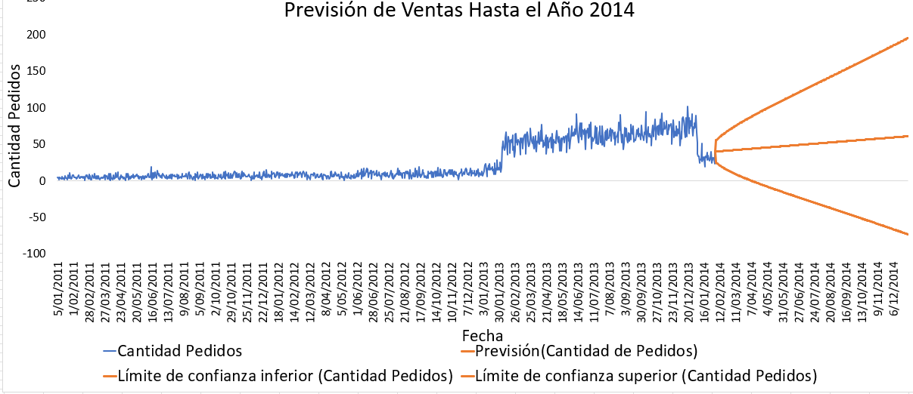
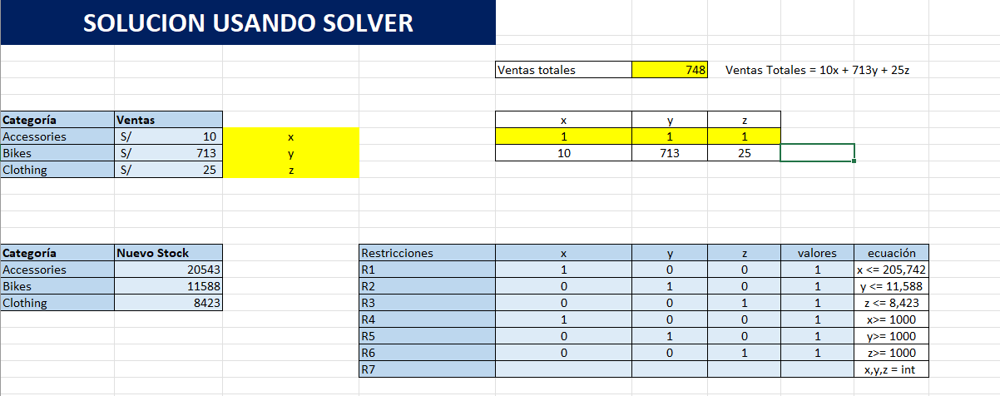
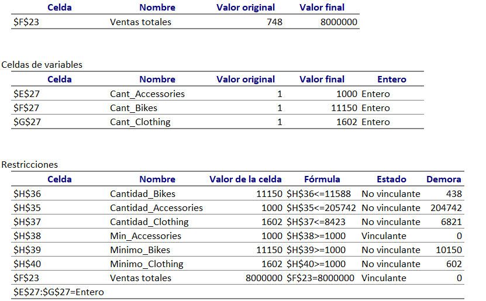
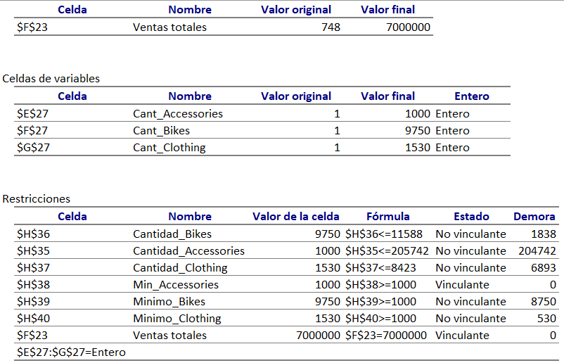
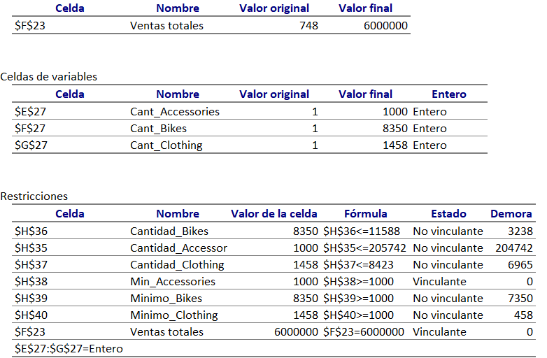

# Simulaciión-Analisis-Excell
## Introducción
Este reporte busca demostrar los diferentes escenarios de ventas, para el año 2014, esta dirigido para la **gerencia de ventas**, plantea 3 escenarios posibles, cada uno con una combinación diferente de ventas por categoría. 
## Resumen del Reporte
### Página 1: Reporte de Escenarios
  
Proporciona una vista de los 3 escenarios planteados en el reporte, cada uno con graficos representativos y proyección de ventas. 

### Página 2: Prevision de Ventas año 2014
  
Se realiza un analisis predictivo de las ventas para el año 2014, para ello se establen límites inferiores y superiores.

### Página 3: Implementación de Solver
  
Se organiza la información, las restricciones y los parametros para realizar el analisis con solver. 

### Página 4: Escenario Agresivo
  
Reporte de Solver, escenario agresivo, ventas de 8,000,000.

### Página 5: Escenario Objetivo
  
Reporte de Solver, escenario objetivo, ventas de 7,000,000.

### Página 6: Escenario Modesto
  
Reporte de Solver, escenario modesto, ventas de 6,000,000.

## Habilidades Mostradas
  - **Esquema de Estrella**: Se implementa un esquema de estrella compuesto por una tabla de hechos principal `fact_ventas` y múltiples tablas de dimensiones, incluyendo `dim_clientes` y `dim_producto`
- **Gráficos Relevantes**: Se emplean **gráficos de pie** y **barras** para analizar comparaciones y distribuciones.
- **Diseño del Reporte**: Se diseña una interfaz clara, intuitiva y visualmente amigable, priorizando la simplicidad y enfocando cada sección en los elementos más relevantes para el análisis.
- **Power Query**: Uso de `Power Query` para la transformación y limpieza de datos, elminación de nulos. 
- **Vista de Diagrama**: Modelado de datos utilizando **Power Pivot** mediante la relación entre tablas `dim_clientes` y `dim_producto` y la tabla  `fact_ventas`, incluyendo la configuración de filtros unidireccionales.
- **DAX**: Desarrollo de cálculos avanzados utilizando `DAX`, para calcular la mediana del precio por categoría.
- **Tabla Dinámicas**: Se implementan tablas dínamicas para resumir información, aprovechando el modelado de datos, podemos realizar tablas dinamicas con filas de diferentes tablas.
## Conclusiones
Este reporte en Excel, busca implementar realizar una prevision de ventas para el año 2014, para ello se establece un modelo de estrella entre las tablas, se plantean diferentes escenarios de ventas y diferentes metas. 

## Sobre Mi 
Buenos días, buenas tardes o buenas noches, dependiendo de cuando leas esto, soy un Estudiante de Ing. Sistemas mi nombre es Danfer Marcelo Ore, me quiero especializar en análisis de datos, este proyecto busca demostrar mi manejo en Excel, principalmente, utilizando herramientas de ánalisis, toda la información de este reporte, proviene de una etapa anterior `1_DWH-Arquitectura-Medallón-SQL-SERVER`.
