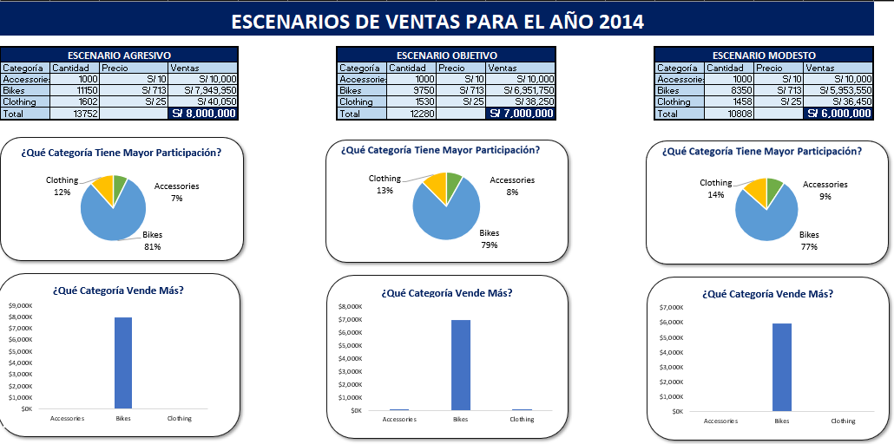

# Análisis y Optimización de Ventas

## Introducción

Este es un proyecto integral que busca representar las diferentes etapas de un proceso ETL y demostrar la integración entre diversas herramientas utilizadas en el análisis y la gestión de datos.

## Resumen del Proyecto

### Etapa 1: Data Warehouse

Esta etapa inicial tiene como objetivo crear una fuente de datos limpia, confiable y estructurada para el análisis posterior.

### Etapa 2: Análisis de Datos

Se realiza un análisis exploratorio de los datos con el objetivo de comprender su comportamiento general, identificar patrones relevantes y generar información de valor para el negocio.

### Etapa 3: Reporte de Ventas

Se desarrolla un reporte interactivo en Power BI para visualizar indicadores clave, facilitar la toma de decisiones y comunicar el estado del negocio de manera clara y efectiva.

### Etapa 4: Simulación de Escenarios y Análisis

Se organizan los datos, restricciones y parámetros necesarios para realizar simulaciones mediante Solver. Se plantean tres escenarios con objetivos distintos para evaluar alternativas y optimizar la toma de decisiones.
## Hallazgos 
- La venta de bicicletas representa el 96% de los ingresos, sin embargo, representa el 37% del total de productos vendidos.
- Se tiene poca diversificación de la cartera de productos, prueba de ellos es que las bicicletas de carretera, representan el 50% de los ingresos totales de la empresa, y las bicicletas de montaña representan el 33.9%.
- Los productos que más se venden son los accesorios siendo el 44% de total de productos vendidos, pero representando apenas el 2.3% de los ingresos totales.
- En términos generales, el año 2012, fue bajo, sin embargo el año 2013, fue extraordinariamente alto, pese a ello el año 2014 ha tenido un muy mal inicio, siendo inferior en ventas que el año 2012 el año antes tenía el peor rendimiento.
- La gran mayoría de ingresos, provienen de países del primer mundo liderando en esto Estados Unidos seguido por varios países de la Unión Europea.
- Se tiene una gran diversificación de la cartera de clientes, siendo que el cliente que más ingresos nos ha generado apenas representa el 2.89% de los ingresos totales.
## Habilidades Demostradas

* **SQL Server:** Desarrollo de consultas avanzadas utilizando CTEs, expresiones CASE, funciones de ventana, agregaciones, JOINs, UNIONs, procedimientos almacenados y manejo de errores.
* **Power BI:** Creación de visualizaciones interactivas mediante gráficos y filtros, utilizando Power Query, DAX, métricas y parámetros.
* **Excel:** Uso de gráficos, tablas dinámicas, Power Query, Power Pivot, DAX y la herramienta Solver para análisis y simulación de escenarios.
* **Herramientas de Planificación:** Planificación y seguimiento de cada etapa del proyecto mediante herramientas como Draw.io, Lucidchart y Notion, garantizando una ejecución organizada y alineada con los objetivos.

## Conclusiones

Para alcanzar los objetivos planteados, se emplean diferentes tecnologías, cada una con una función específica dentro del flujo de trabajo. La integración de estas herramientas permite construir una solución completa que abarca desde la preparación de datos hasta el análisis, la visualización y la optimización de escenarios para la toma de decisiones.

## Sobre Mi 
Buenos días, buenas tardes o buenas noches, dependiendo de cuando leas esto, soy Estudiante de Ing. Sistemas mi nombre es Danfer Marcelo Ore, este proyecto busca demostrar mi manejo en diferentes tecnología como SQL Server, Power Bi y Excel. 
