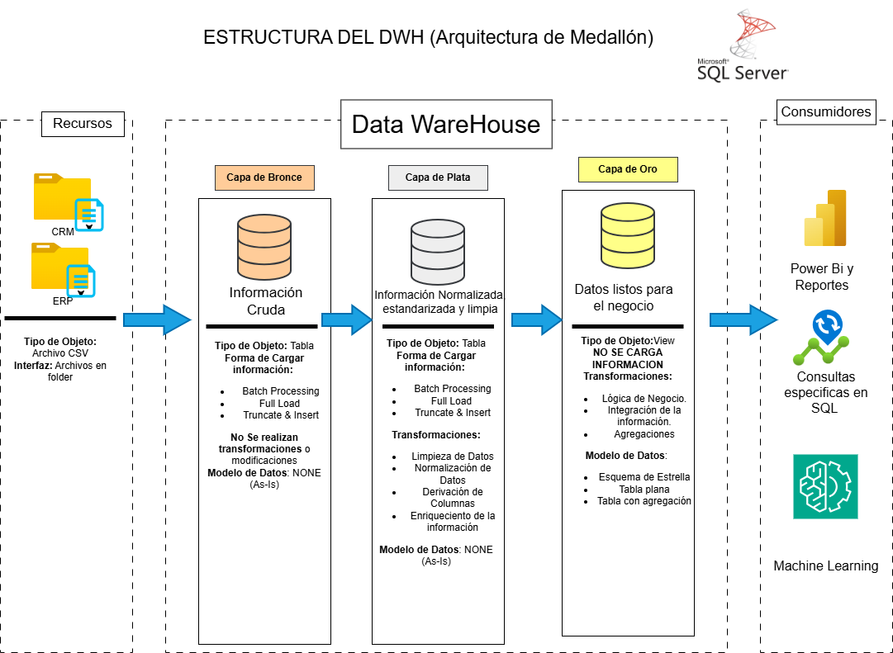

# analisis-y-optimizacion-de-ventas

## Introducción
Este es un proyecto completo, que busca representar las diferentes etapas de un ETL, demuestra la integración entre las diversas herramientas en cada etapa de este proyecto se cumple con un objetivo en específico.

## Resumen del Reporte
### Etapa 1: Data WareHouse
  
Esta etapa inicial busca crear una fuenta limpia y confiable de datos. 

### Etapa 2: Analisis de Datos
  
Se realiza un analisis datos con el objetivo de tener una idea general del comportamiento de los datos y brindar información específica. 

### Etapa 3: Reporte de Ventas
  
Creación de un reporte en Power BI, se busca mostrar información relevante que apoye la toma de decisiones e informe la situación del negocio. 

### Etapa 4: Simulación de Casos
  
Se organiza la información, las restricciones y los parametros para realizar el analisis con solver.

## Habilidades Mostradas
  - **Esquema de Estrella**: Se implementa un esquema de estrella compuesto por una tabla de hechos principal `fact_ventas` y múltiples tablas de dimensiones, incluyendo `dim_clientes` y `dim_producto`
- **Gráficos Relevantes**: Se emplean **gráficos de pie** y **barras** para analizar comparaciones y distribuciones.
- **Diseño del Reporte**: Se diseña una interfaz clara, intuitiva y visualmente amigable, priorizando la simplicidad y enfocando cada sección en los elementos más relevantes para el análisis.
- **Power Query**: Uso de `Power Query` para la transformación y limpieza de datos, elminación de nulos. 
- **Vista de Diagrama**: Modelado de datos utilizando **Power Pivot** mediante la relación entre tablas `dim_clientes` y `dim_producto` y la tabla  `fact_ventas`, incluyendo la configuración de filtros unidireccionales.
- **DAX**: Desarrollo de cálculos avanzados utilizando `DAX`, para calcular la mediana del precio por categoría.
- **Tabla Dinámicas**: Se implementan tablas dínamicas para resumir información, aprovechando el modelado de datos, podemos realizar tablas dinamicas con filas de diferentes tablas.
## Conclusiones
Este reporte en Excel, busca implementar realizar una prevision de ventas para el año 2014, para ello se establece un modelo de estrella entre las tablas, se plantean diferentes escenarios de ventas y diferentes metas. 

## Sobre Mi 
Buenos días, buenas tardes o buenas noches, dependiendo de cuando leas esto, soy un Estudiante de Ing. Sistemas mi nombre es Danfer Marcelo Ore, me quiero especializar en análisis de datos, este proyecto busca demostrar mi manejo en Excel, principalmente, utilizando herramientas de ánalisis, toda la información de este reporte, proviene de una etapa anterior `1_DWH-Arquitectura-Medallón-SQL-SERVER`.
